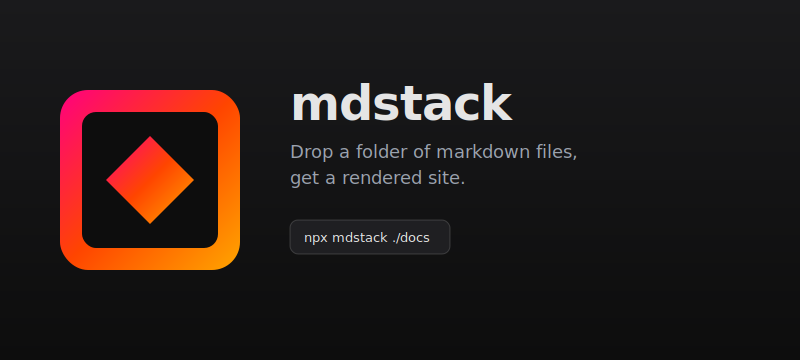
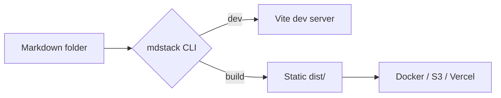
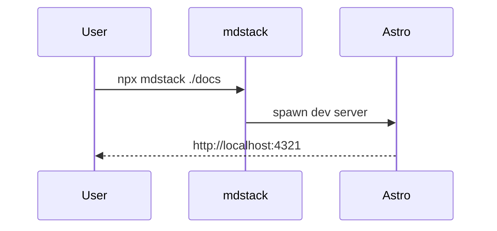

# Element showcase

Every standard markdown element rendered with the current theme. Use the **On this page** sidebar on the left to jump between sections.

## Headings

Each level h1–h6 has its own treatment. Only `h2` and `h3` show up in the left TOC.

### Third-level heading

#### Fourth-level heading

##### Fifth-level heading

###### Sixth-level heading

## Text formatting

A regular paragraph. **Bold uses the brand gradient.** *Italic just changes the slant.* You can combine ***both at once.***

GitHub-flavored markdown supports ~~strikethrough~~ via tildes, and `==` wraps a ==highlighted phrase== using mdstack's mark extension.

Inline `code` renders in the mono stack with a tinted background. A keyboard shortcut like <kbd>Cmd</kbd> + <kbd>K</kbd> uses inline HTML.

A line break with two trailing spaces  
ends up as a soft break inside the same paragraph.

## Strikethrough & highlight

Strike out outdated content with double tildes:

> The release ~~ships on Friday~~ is now scheduled for next Tuesday.

Highlight key phrases with double equals — handy for callouts, search results, or drawing the eye to ==the part that actually matters==. You can chain several: ==first==, ==second==, and ==third==. Inside other inline formatting works too: **bold with ==a highlight== inside** and *italic with ==another one==*.

Both also work via inline HTML: <del>removed</del> and <mark>marked</mark>.

## Links

A regular [inline link](https://astro.build) underlines and shifts to gradient on hover.

Links with a title attribute look the same: [hover me](https://astro.build "Astro homepage").

Bare auto-links work too: <https://github.com>.

Email auto-links: <hello@example.com>.

A reference-style [link to docs][astro-docs] keeps the URL out of the prose.

[astro-docs]: https://docs.astro.build

## Lists

Unordered:

- First item
- Second item with **bold inside**
  - Nested item
  - Another nested item with `inline code`
- Third item with a [link](https://astro.build)

Ordered:

1. Step one
2. Step two
3. Step three
   1. Sub-step a
   2. Sub-step b

Mixed nesting:

- Top-level bullet
  1. Numbered child
  2. Another numbered child
- Back to bullets

Task list:

- [x] Set up the layout
- [x] Wire the theme
- [ ] Add a search palette
- [ ] Document custom directives

## Blockquote

> A short quote. The signature visual is the gradient left border. Inline `code` and **bold** still flow through correctly inside.

> A multi-line quote.
>
> With an empty quoted line creating a paragraph break inside the same quote.

> Outer quote.
>
> > Nested quote with its own border.
> >
> > Useful for replies-within-replies.

## Code

Inline `const greeting = "hi"`. A typed block:

```ts
import { defineCollection, z } from 'astro:content';
import { glob } from 'astro/loaders';

export const collections = {
  docs: defineCollection({
    loader: glob({ pattern: '**/*.md', base: process.env.MD_SOURCE }),
    schema: z.object({
      title: z.string().optional(),
      order: z.number().optional(),
    }),
  }),
};
```

Shell:

```bash
# Spin up dev
npx mdstack ./docs

# Static build
npx mdstack build ./docs
```

JSON:

```json
{
  "name": "mdstack",
  "version": "0.1.0",
  "bin": { "mdstack": "./bin/cli.js" }
}
```

CSS:

```css
:root {
  --grad: linear-gradient(135deg, #ff0080, #ff4500, #ffa500);
}
```

A code block with no language label:

```
plain output, no syntax highlighting
$ ls
example  package.json  README
```

## Tables

Basic table:

| Field   | Type   | Default   | Notes                              |
| ------- | ------ | --------- | ---------------------------------- |
| `title` | string | filename  | Shown in top nav and `<title>`     |
| `order` | number | ∞         | Lower numbers come first           |
| `theme` | string | `angular` | Reserved for future per-page theme |

With column alignment:

| Left      | Center      | Right      |
| :-------- | :---------: | ---------: |
| start     | middle      | end        |
| `npm`     | `pnpm`      | `yarn`     |
| short     | the longest | medium-ish |

## Images

Drop image files anywhere alongside your markdown — `mdstack` serves them in dev and copies them into `dist/` on build. Both **relative** and **absolute** (root-from-source) paths work:

Relative path (`./images/sample.svg`):



Absolute path from source root (`/images/sample.svg`):


Inline HTML `` tags are also rewritten, so you can size them:


## Math

Inline math compiles via KaTeX: $E = mc^2$, $\sum_{i=1}^{n} i = \frac{n(n+1)}{2}$, and $\nabla \cdot \mathbf{E} = \frac{\rho}{\varepsilon_0}$.

Block math gets its own padded container:

$$
\int_{-\infty}^{\infty} e^{-x^2} \, dx = \sqrt{\pi}
$$

$$
\binom{n}{k} = \frac{n!}{k!\,(n-k)!}
$$

## Diagrams

Mermaid blocks render client-side and follow the active theme:





## Horizontal rule

Above the line.

---

Below the line. The rule itself is rendered as the brand gradient.

## Footnotes

Markdown supports footnotes[^note]. They're handy for citations[^cite] without breaking the flow.

[^note]: This is a footnote — it appears at the bottom of the page.
[^cite]: Multiple footnotes are rendered in order with back-links.

## Inline HTML

Sometimes you need to drop in raw HTML for things markdown can't express.

A collapsible `<details>` block:

<details>
  <summary>Click to expand</summary>

  Hidden content lives here. You can put **markdown** inside, including lists:

  - Item one
  - Item two

</details>

A `<kbd>` chord: press <kbd>Ctrl</kbd> + <kbd>Shift</kbd> + <kbd>P</kbd>.

Use `<mark>` to render a <mark>highlighted phrase</mark> inline.

## Long section for scroll-spy

Filler so scrolling through this page exercises the active-section highlighting in the left TOC.

Lorem ipsum dolor sit amet, consectetur adipiscing elit. Sed do eiusmod tempor incididunt ut labore et dolore magna aliqua. Ut enim ad minim veniam, quis nostrud exercitation ullamco laboris nisi ut aliquip ex ea commodo consequat.

### Sub-section A

Duis aute irure dolor in reprehenderit in voluptate velit esse cillum dolore eu fugiat nulla pariatur. The third-level heading appears in the TOC, indented under its parent H2.

### Sub-section B

Even more filler. Scroll up and down — the active item in the left sidebar should track the heading currently at the top of the viewport.
